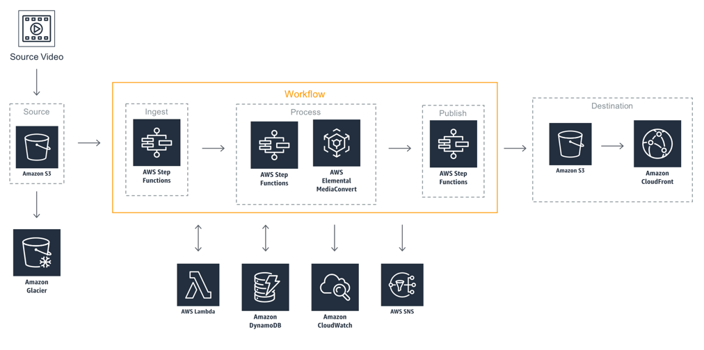

# Video on Demand on AWS

How to implement a video-on-demand workflow on AWS leveraging AWS Step Functions, AWS Elemental MediaConvert, and AWS Elemental MediaPackage.
Source code for [Video on Demand on AWS](https://aws.amazon.com/solutions/video-on-demand-on-aws/) solution.

## On this Page
- [Architecture Overview](#architecture-overview)
- [Deployment](#deployment)
- [Workflow Configuration](#workflow-configuration)
- [Source Metadata Option](#source-metadata-option)
- [Encoding Templates](#encoding-templates)
- [QVBR Mode](#qvbr-mode)
- [Accelerated Transcoding](#accelerated-transcoding)
- [Source Code](#source-code)
- [Creating a custom Build](#creating-a-custom-build)
- [Additional Resources](#additional-resources)

## Architecture Overview


## Deployment
The solution is deployed using a CloudFormation template with a lambda backed custom resource. For details on deploying the solution please see the details on the solution home page: [Video on Demand on AWS](https://aws.amazon.com/answers/media-entertainment/video-on-demand-on-aws/)

> **Please ensure you test the new template before updating any production deployments.**

## Workflow Configuration
The workflow configuration is set at deployment and is defined as environment variables for the input-validate lambda function (which is the first step in the ingest process).

#### Environment Variables:
* **Archive Source:**	If enabled, the source video file will be tagged for archiving to glacier at the end of the workflow
* **CloudFront:**	CloudFront domain name, used to generate the playback URLs for the MediaConvert outputs
* **Destination:**	The name of the destination S3 bucket for all of the MediaConvert outputs
* **FrameCapture:**	If enabled frame capture is added to the job submitted to MediaConvert
* **InputRotate:**	Defines how the MediaConvert rotates your video
* **MediaConvert_Template_2160p:**	The name of the UHD template in MediaConvert
* **MediaConvert_Template_1080p:**	The name of the HD template in MediaConvert
* **MediaConvert_Template_720p:**	The name of the SD template in MediaConvert
* **Source:**	The name of the source S3 bucket
* **WorkflowName:**	Used to tag all of the MediaConvert encoding jobs
* **acceleratedTranscoding** Enabled Accelerated Transocding in MediaConvert. options include ENABLE, DISABLE, PREFERRED. for more detials please see: 
* **enableSns** Send SNS notifications for the workflow results.
* **enableSqs** Send the workflow results to an SQS queue

### WorkFlow Triggers

#### Source Video Option
If deployed with the workflow trigger parameter set to VideoFile, the CloudFormation template will configure S3 event notifications on the source S3 bucket to trigger the workflow whenever a video file (mpg, mp4, m4v, mov, or m2ts) is uploaded.

#### Source Metadata Option
If deployed with the workflow trigger parameter set to MetadataFile, the S3 notification is configured to trigger the workflow whenever a JSON file is uploaded. This allows different workflow configuration to be defined for each source video processed by the workflow.

> **Important:** The source video file must be uploaded to S3 before the metadata file is uploaded, and the metadata file must be valid JSON with a .json file extension. With source metadata enabled uploading video files to Amazon S3 will not trigger the workflow.

**Example JSON metadata file:**
```
{
    "srcVideo": "example.mpg",
    "archiveSource": true,
    "frameCapture": false,
    "jobTemplate": "custom-job-template"
}
```

The only required field for the metadata file is the **srcVideo**. The workflow will default to the environment variables settings for the ingest validate lambda function for any settings not defined in the metadata file.

**Full list of options:**
```
{
    "srcVideo": "string",
    "archiveSource": string,
    "frameCapture": boolean,
    "srcBucket": "string",
    "destBucket": "string",
    "cloudFront": "string",
    "jobTemplate_2160p": "string",
    "jobTemplate_1080p": "string",
    "jobTemplate_720p": "string",
    "jobTemplate": "custom-job-template",
    "inputRotate": "DEGREE_0|DEGREES_90|DEGREES_180|DEGREES_270|AUTO",
    "captions": {
        "srcFile": "string",
        "fontSize": integer,
        "fontColor": "WHITE|BLACK|YELLOW|RED|GREEN|BLUE"
    }
}
```

The solution also supports adding additional metadata, such as title, genre, or any other information, you want to store in Amazon DynamoDB.

## Encoding Templates
At launch the Solution creates 3 MediaConvert job templates which are used as the default encoding templates for the workflow:
- **MediaConvert_Template_2160p**
- **MediaConvert_Template_1080p**
- **MediaConvert_Template_720p**

By default, the profiler step in the process step function will check the source video height and set the parameter "jobTemplate" to one of the available templates. This variable is then passed to the encoding step which submits a job to Elemental MediaConvert. To customize the encoding templates used by the solution you can either replace the existing templates or you can use the source metadata version of the workflow and define the jobTemplate as part of the source metadata file.

**To replace the templates:**
1.	Use the system templates or create 3 new templates through the MediaConvert console (see the Elemental MediaConvert documentation for details).
2.	Update the environment variables for the input validate lambda function with the names of the new templates.

**To define the job template using metadata:**
1.	Launch the solution with source metadata parameter. See Appendix E for more details.
2.	Use the system templates or create a new template through the MediaConvert console (see the Elemental MediaConvert documentation for details).
3.	Add "jobTemplate":"name of the template" to the metadata file, this will overwrite the profiler step in the process Step Functions.

## QVBR Mode
AWS MediaConvert Quality-defined Variable Bit-Rate (QVBR) control mode gets the best video quality for a given file size and is recommended for OTT and Video On Demand Content. The solution supports this feature and it will create HLS, MP4 and DASH custom presets with the following QVBR levels and Single Pass HQ encoding:

| Resolution   |      MaxBitrate      |  QvbrQualityLevel |
|----------|:-------------:|------:|
| 2160p |  15000Kbps | 9 |
| 1080p |  8500Kbps  | 8 |
| 720p  |  6000Kbps  | 8 |
| 720p  |  5000Kbps  | 8 |
| 540p  |  3500Kbps  | 7 |
| 360p  |  1500Kbps  | 7 |
| 270p  |  400Kbps   | 7 |

For more detail please see [QVBR and MediaConvert](https://docs.aws.amazon.com/mediaconvert/latest/ug/cbr-vbr-qvbr.html).

## Accelerated Transcoding 
Version 5.1.0 introduces support for accelerated transcoding which is a pro tier  feature of AWS Elemental MediaConvert. This feature can be configured when launching the template with one of the following options:

* **ENABLED** All files upload will have acceleration enabled. Files that are not supported will not be processed and the workflow will fail
* **PREFERRED** All files uploaded will be processed but only supported files will have acceleration enabled, the workflow will not fail.
* **DISABLED** No acceleration.

For more detail please see [Accelerated Transcoding](https://docs.aws.amazon.com/mediaconvert/latest/ug/accelerated-transcoding.html).

## Source code

### Node.js 12
* **archive-source:** Lambda function to tag the source video in s3 to enable the Glacier lifecycle policy.
* **custom-resource:** Lambda backed CloudFormation custom resource to deploy MediaConvert templates configure S3 event notifications.
* **dynamo:** Lambda function to Update DynamoDB.
* **encode:** Lambda function to submit an encoding job to Elemental MediaConvert.
* **error-handler:** Lambda function to handler any errors created by the workflow or MediaConvert.
* **input-validate:** Lambda function to parse S3 event notifications and define the workflow parameters.
* **media-package-assets:** Lambda function to ingest an asset into MediaPackage-VOD.
* **output-validate:** Lambda function to parse MediaConvert CloudWatch Events.
* **profiler:** Lambda function used to send publish and/or error notifications.
* **step-functions:** Lambda function to trigger AWS Step Functions.

### Python 3.7
* **mediainfo:** Lambda function to run [mediainfo](https://mediaarea.net/en/MediaInfo) on an S3 signed url.

> ./source/mediainfo/bin/mediainfo must be made executable before deploying to lambda.

## Creating a custom build
The solution can be deployed through the CloudFormation template available on the solution home page: [Video on Demand on AWS](https://aws.amazon.com/answers/media-entertainment/video-on-demand-on-aws/).
To make changes to the solution, download or clone this repo, update the source code and then run the deployment/build-s3-dist.sh script to deploy the updated Lambda code to an Amazon S3 bucket in your account.

### Prerequisites:
* [AWS Command Line Interface](https://aws.amazon.com/cli/)
* Node.js 12.x or later
* Python 3.8 or later

### 1. Running unit tests for customization
Run unit tests to make sure added customization passes the tests:
```
cd ./deployment
chmod +x ./run-unit-tests.sh
./run-unit-tests.sh
```

### 2. Create an Amazon S3 Bucket
The CloudFormation template is configured to pull the Lambda deployment packages from Amazon S3 bucket in the region the template is being launched in. Create a bucket in the desired region with the region name appended to the name of the bucket (e.g. for us-east-1 create a bucket named ```my-bucket-us-east-1```).
```
aws s3 mb s3://my-bucket-us-east-1
```

### 3. Build MediaInfo
Build MediaInfo using the following commands on an [EC2 instance](https://docs.aws.amazon.com/AWSEC2/latest/UserGuide/EC2_GetStarted.html) running an Amazon Linux AMI. 

```console
sudo yum update -y
sudo yum groupinstall 'Development Tools' -y
sudo yum install libcurl-devel -y
wget https://mediaarea.net/download/binary/mediainfo/20.09/MediaInfo_CLI_20.09_GNU_FromSource.tar.xz
tar xvf MediaInfo_CLI_20.09_GNU_FromSource.tar.xz
cd MediaInfo_CLI_GNU_FromSource/
./CLI_Compile.sh --with-libcurl
```

Run these commands to confirm the compilation was successful:
```console
cd MediaInfo/Project/GNU/CLI/
./mediainfo --version
```
Copy the mediainfo binary into the `source/mediainfo/bin` directory of your cloned respository.

If you'd like to use a precompiled MediaInfo binary for Lambda built by the MediaArea team, you can download it [here](https://mediaarea.net/en/MediaInfo/Download/Lambda). 
For more information, check out the [MediaInfo site](https://mediaarea.net/en/MediaInfo).


### 4. Create the deployment packages
Build the distributable:
```
chmod +x ./build-s3-dist.sh
./build-s3-dist.sh my-bucket video-on-demand-on-aws version
```

> **Notes**: The _build-s3-dist_ script expects the bucket name as one of its parameters, and this value should not include the region suffix.

Deploy the distributable to the Amazon S3 bucket in your account:
```
aws s3 cp ./regional-s3-assets/ s3://my-bucket-us-east-1/video-on-demand-on-aws/version/ --recursive --acl bucket-owner-full-control
```

### 5. Launch the CloudFormation template.
* Get the link of the video-on-demand-on-aws.template uploaded to your Amazon S3 bucket.
* Deploy the Video on Demand to your account by launching a new AWS CloudFormation stack using the link of the video-on-demand-on-aws.template.

## Additional Resources

### Services
- [AWS Elemental MediaConvert](https://aws.amazon.com/mediaconvert/)
- [AWS Elemental MediaPackage](https://aws.amazon.com/mediapackage/)
- [AWS Step Functions](https://aws.amazon.com/step-functions/)
- [AWS Lambda](https://aws.amazon.com/lambda/)
- [Amazon CloudFront](https://aws.amazon.com/cloudfront/)
- [OTT Workflows](https://www.elemental.com/applications/ott-workflows)
- [QVBR and MediaConvert](https://docs.aws.amazon.com/mediaconvert/latest/ug/cbr-vbr-qvbr.html)

### Other Solutions and Demos
- [Live Streaming On AWS](https://aws.amazon.com/solutions/live-streaming-on-aws/)
- [Media Analysis Solution](https://aws.amazon.com/solutions/media-analysis-solution/)
- [Live Streaming and Live to VOD Workshop](https://github.com/awslabs/speke-reference-server)
- [Live to VOD with Machine Learning](https://github.com/aws-samples/aws-elemental-instant-video-highlights)
- [Demo SPEKE Reference Server](https://github.com/awslabs/speke-reference-server)

***

Copyright 2020 Amazon.com, Inc. or its affiliates. All Rights Reserved.

Licensed under the Apache License, Version 2.0 (the "License");
you may not use this file except in compliance with the License.
You may obtain a copy of the License at

    http://www.apache.org/licenses/LICENSE-2.0

Unless required by applicable law or agreed to in writing, software
distributed under the License is distributed on an "AS IS" BASIS,
WITHOUT WARRANTIES OR CONDITIONS OF ANY KIND, either express or implied.
See the License for the specific language governing permissions and
limitations under the License.
